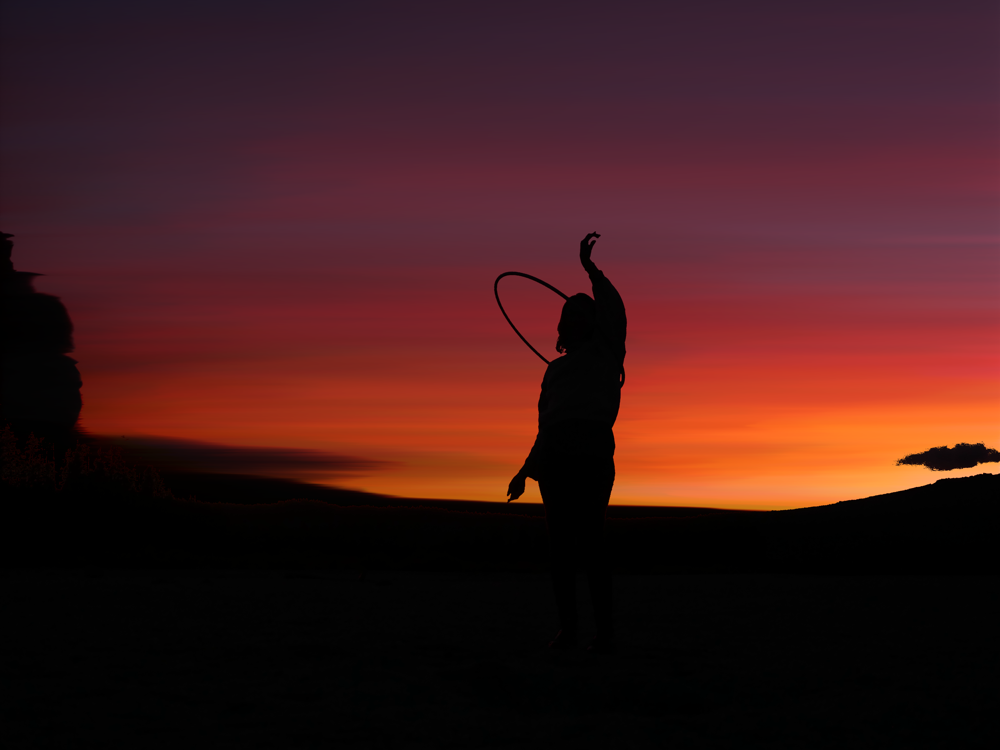

# Go Image Filter

A simple image filtering program.

See `./img` for samples

Run `go run -h` for instructions

## Row filter
Replace each row in the image with the min, avg or max color value in the original row.

That's boring, let's add a shadow mask.

Or sort the colors in each row.

## Checkerbox filter

With shadow and highlight massks

# More samples!

